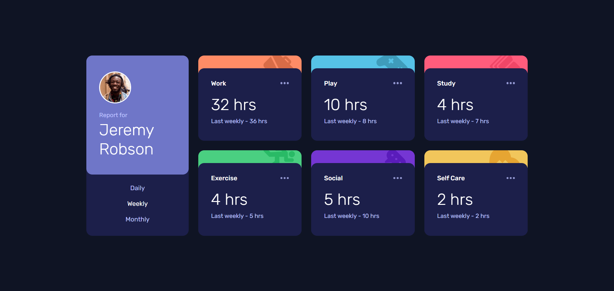

# Frontend Mentor - Time Tracking Dashboard Solution

This is a solution to the [Time tracking dashboard challenge on Frontend Mentor](https://www.frontendmentor.io/challenges/time-tracking-dashboard-UIQ7167Jw).

## Table of contents

- [Overview](#overview)
  - [The challenge](#the-challenge)
  - [Screenshot](#screenshot)
  - [Links](#links)
- [My process](#my-process)
  - [Built with](#built-with)
  - [What I learned](#what-i-learned)
  - [Continued development](#continued-development)
  - [AI Collaboration](#ai-collaboration)
- [Author](#author)

---

## Overview

### The challenge

Users should be able to:

- View the optimal layout for the site depending on their device's screen size
- See hover states for all interactive elements on the page
- Switch between viewing Daily, Weekly, and Monthly stats

### Screenshot



### Links

- Solution URL: [GitHub Repository](https://github.com/Ismaellerakotoson/time-tracking-dashboard)
- Live Site URL: [Live Demo](https://ismaellerakotoson.github.io/time-tracking-dashboard/)

---

## My process

### Built with

- Semantic HTML5 markup
- CSS custom properties
- Flexbox
- CSS Grid
- Mobile-first workflow
- Vanilla JavaScript
- `fetch` API for JSON data loading

### What I learned

#### Accessing a dynamic key in a JavaScript object

Instead of hardcoding the key, I use bracket notation to pass a variable:

```js
data[i].timeframes[period].current
```

#### Refactoring repetitive code into a reusable function

Instead of repeating three identical blocks for each button, I created a function that takes the period as a parameter:

```js
function updateCards(data, period) {
  for (let i = 0; i < data.length; i++) {
    hours[i].textContent = data[i].timeframes[period].current;
    last_value[i].textContent = data[i].timeframes[period].previous;
    time_selector[i].textContent = `${period} -`;
  }
}

daily.addEventListener("click", () => updateCards(data, "daily"));
weekly.addEventListener("click", () => updateCards(data, "weekly"));
monthly.addEventListener("click", () => updateCards(data, "monthly"));
```

#### Placing `addEventListener` in the right scope

Event listeners must be inside the `.then()` to have access to the JSON data, but outside the loop to avoid registering duplicates.

### Continued development

- Improve accessibility (ARIA attributes on active buttons)
- Add a transition animation when switching between periods
- Explore ES6 modules

### AI Collaboration

I used **Claude (Anthropic)** as a learning guide throughout this project.

- **How:** Claude didn't give me solutions directly — it asked questions to help me find the answers myself (debugging, loop logic, refactoring).
- **What worked well:** Understanding *why* each thing works rather than copy-pasting code.
- **What was challenging:** Variable scope (`data` being inaccessible outside the `.then()`), and the difference between `.period` and `[period]`.

---

## Author

- Frontend Mentor - [@Ismaellerakotoson](https://www.frontendmentor.io/profile/Ismaellerakotoson)
- GitHub - [@Ismaellerakotoson](https://github.com/Ismaellerakotoson)